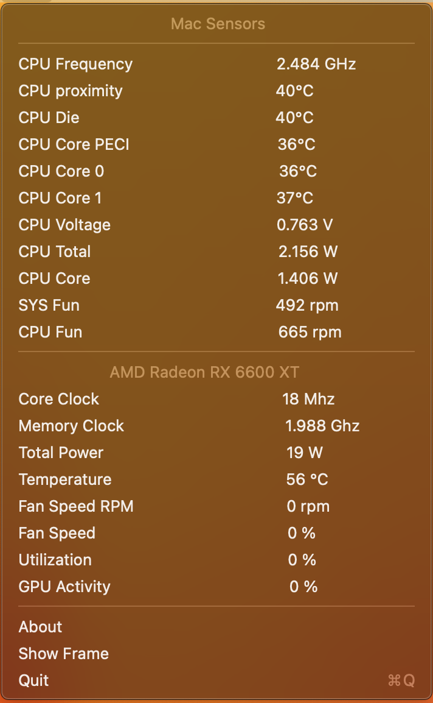

# Mac-Sensors
Mac Sensors

The Mac Sensors program was developed exclusively for the macOS platform, it was developed with the aim of displaying all the sensors that are available on Mac.

The program has 5 tabs.

The first (Mac), general information about the system.

Second (CPU), CPU information, all available sensors,

The third (GPU), information about the video core, support is only for video cards from AMD,

The fourth (SMCIO), information about voltage sensors, and fan speed, support only if there is SMCIO,

The fifth (Settings), program settings, while you can set the sensor update interval.

1. Mac

2. CPU

3. GPU 

4. SMCIO

There is also support for displaying information in the tray status for quick access to sensor indicators.

The program works in the background and uses a small amount of system resources, usually it is 1%, you can further reduce this indicator by setting a longer update interval in the settings, for example, two or three seconds.

Now about support, for now, support is available, on all processors from Intel, video cards are supported from RX 550 to RX 6900XT.

To open all the functionality of the program, you need to be!

- VirtualSMC.kext 
- SMCProcessor.kext required to display processor sensors
- SMCSuperIO.kext   required to display voltage sensors

You don't need to do anything to display the graphics card!

It is very important to check that you have the correct settings in the Config.plist
Misc->Security->ExposeSensitiveData == [ 14 ] 
You can see the layout here [Config](https://github.com/DiCode77/Mac-Sensors/blob/main/img/6.jpg)

Support is from macOS Monterey to macOS Ventura.

The program is still at the stage of testing and development.
